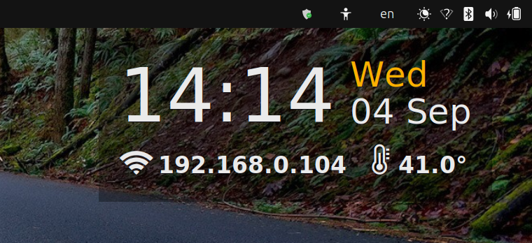
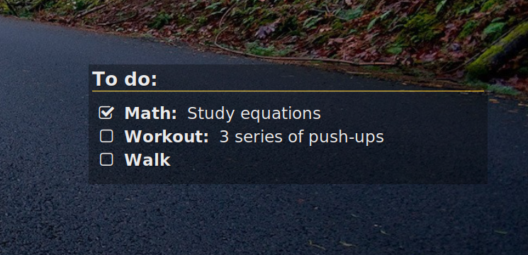
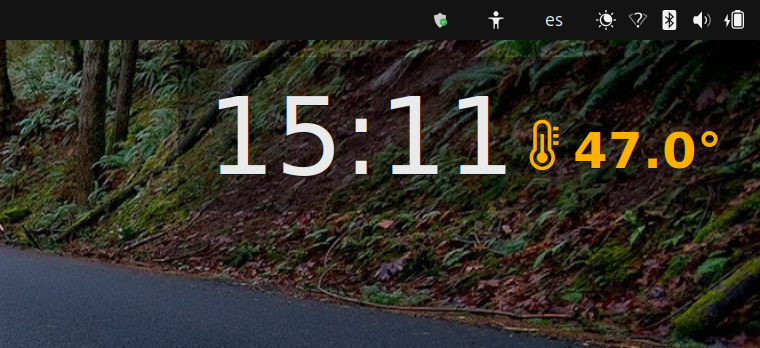

# Conky
### Date, Local IP and Temperature

This script shows a minimalist frame that contain a date field, the local ip address and the cpu temperature. The font myConkySymbols provided must be installed first. 



### To-Do: 
For use the **todo_and_description_from_file.conf**, a file named **todo.md** must be created in the home directory with the following structure: a letter from our myConkySymbols, a space  separation followed by a word which will be bold and one or more optional words corresponding to the description.

The To-Do list is limited by 3 items only.  

**E.g:**

```
v Math: Study equations
u Workout: 3 series of push-ups 
u Walk 
```



### hour_temp_minimalist:  
This script shows a minimalist clock and temperature monitor.  The temperature indicator color is white if the temperature is lower than 46º, the color change to orange if the temperature is between 46º and 55º, and change to red if it is greater than 55º.


